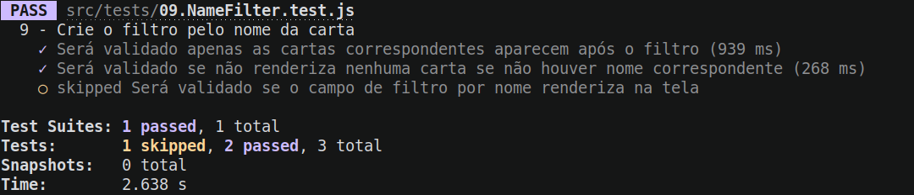

### Termos e acordos

Ao iniciar este projeto, você concorda com as diretrizes do Código de Ética e Conduta e do Manual da Pessoa Estudante da Trybe.

---

# Boas vindas ao repositório do projeto Trybe Trunfo!

Você já usa o GitHub diariamente para desenvolver os exercícios, certo? Agora, para desenvolver os projetos, você deverá seguir as instruções a seguir. Fique atento a cada passo, e se tiver qualquer dúvida, nos envie por _Slack_! #vqv 🚀

Aqui você vai encontrar os detalhes de como estruturar o desenvolvimento do seu projeto a partir deste repositório, utilizando uma branch específica e um _Pull Request_ para colocar seus códigos.

---


# Sumário

- [Boas vindas ao repositório do projeto Trybe Trunfo!](#boas-vindas-ao-repositório-do-projeto-trybe-trunfo)
- [Sumário](#sumário)
- [Habilidades](#habilidades)
- [Entregáveis](#entregáveis)
  - [O que deverá ser desenvolvido](#o-que-deverá-ser-desenvolvido)
  - [Desenvolvimento](#desenvolvimento)
  - [Data de Entrega](#data-de-entrega)
- [Observações técnicas](#observações-técnicas)
  - [Renderização Condicional](#renderização-condicional)
- [Instruções para entregar seu projeto](#instruções-para-entregar-seu-projeto)
  - [Antes de começar a desenvolver](#antes-de-começar-a-desenvolver)
  - [Durante o desenvolvimento](#durante-o-desenvolvimento)
  - [Depois de terminar o desenvolvimento (opcional)](#depois-de-terminar-o-desenvolvimento-opcional)
- [Como desenvolver](#como-desenvolver)
  - [Linter](#linter)
  - [Execução de testes unitários](#execução-de-testes-unitários)
- [Requisitos do projeto](#requisitos-do-projeto)
  - [1. Crie o formulário que será usado para adicionar cartas ao baralho](#1-crie-o-formulário-que-será-usado-para-adicionar-cartas-ao-baralho)
  - [2. Adicione as props necessárias ao componente de formulário](#2-adicione-as-props-necessárias-ao-componente-de-formulário)
  - [3. Crie e renderize o componente Card com as props necessárias](#3-crie-e-renderize-o-componente-card-com-as-props-necessárias)
  - [4. Crie o preview da carta que está sendo construída pelo formulário](#4-crie-o-preview-da-carta-que-está-sendo-construída-pelo-formulário)
  - [5. Faça a validação do botão de Salvar no formulário](#5-faça-a-validação-do-botão-de-salvar-no-formulário)
  - [6. Crie a função do botão salvar](#6-crie-a-função-do-botão-salvar)
  - [7. Crie a validação do Super Trunfo](#7-crie-a-validação-do-super-trunfo)
  - [8. Exiba a lista de cartas que estão salvas no estado](#8-exiba-a-lista-de-cartas-que-estão-salvas-no-estado)
  - [9. Crie o filtro pelo nome da carta](#9-crie-o-filtro-pelo-nome-da-carta)
  - [10. Crie o filtro por raridade da carta](#10-crie-o-filtro-por-raridade-da-carta)
  - [11. Crie o filtro de Super Trunfo](#11-crie-o-filtro-de-super-trunfo)
  - [12. Crie um botão para remover uma carta do baralho](#12-crie-um-botão-para-remover-uma-carta-do-baralho)
- [Requisitos bônus](#requisitos-bônus)
  - [13. Crie o botão de edição da carta](#13-crie-o-botão-de-edição-da-carta)
  - [14. Faça a validação do botão de Salvar no formulário de edição](#14-faça-a-validação-do-botão-de-salvar-no-formulário-de-edição)
  - [15. Faça a edição dos campos da carta selecionada](#15-faça-a-edição-dos-campos-da-carta-selecionada)
  - [16. Faça o botão de Cancelar para o formulário de edição](#16-faça-o-botão-de-cancelar-para-o-formulário-de-edição)
  - [Bônus não avaliativo](#bônus-não-avaliativo)
    - [Regras do Jogo](#regras-do-jogo)
    - [O que será necessário](#o-que-será-necessário)
  - [17. Iniciar o jogo](#17-iniciar-o-jogo)
  - [18. Criar botão Próxima Carta](#18-criar-botão-próxima-carta)
  - [19. Recomeçar o jogo](#19-recomeçar-o-jogo)
- [Avisos Finais](#avisos-finais)

---

# Habilidades
Neste projeto, verificamos se voce é capaz de:

  * Ler o estado de um componente e usá-lo para alterar o que exibimos no browser

  * Inicializar um componente, dando a ele um estado pré-definido

  * Atualizar o estado de um componente

  * Capturar eventos utilizando a sintaxe do React

  * Criar formulários utilizando sintaxe JSX com as tags: `input`, `textarea`, `select`, `form`, `checkbox`

  * Transmitir informações de componentes filhos para componentes pais via callbacks

---

# Entregáveis

## O que deverá ser desenvolvido

Neste projeto você vai desenvolver um jogo no estilo Super Trunfo! Ao utilizar essa aplicação uma pessoa usuária deverá ser capaz de:

  * Criar um baralho, com o tema livre;

  * Adicionar, remover e editar uma carta do baralho;

  * Visualizar todas as cartas que foram adicionadas ao baralho;

  * Jogar com o baralho criado.

Para entregar o seu projeto você deverá criar um Pull Request neste repositório.

Lembre-se que você pode consultar nosso conteúdo sobre [Git & GitHub](https://course.betrybe.com/intro/git/) sempre que precisar

## Desenvolvimento

Você deve desenvolver uma aplicação em React com manipulação de estados em classes. Essa aplicação simulará um jogo de **Super Trunfo**, desde a criação das cartas do seu baralho até a funcionalidade de jogar.

Na renderização das cartas, sua aplicação deverá possuir três filtros de listagem de cartas: filtro por **nome**, por **raridade** e por **Super Trunfo**. Os filtros **nome** e **raridade** são acumulativos. O filtro **Super Trunfo** funciona de forma independente.

O tema do seu baralho é **livre**, então explore a sua criatividade! Mas use seu bom senso para a criação do seu baralho. Lembre-se das normas de conduta e ética no Manual de Estudante.

## Data de Entrega

  - Projeto individual.

  - Serão dois dias de projeto.
  
  - Data de entrega para avaliação final do projeto: `DD/MM/YYYY - 14:00h`.

---
# Observações técnicas

## Renderização condicional

Em alguns requisitos será necessária a utilização de renderização condicional. Você pode verificar a documentação do React [Renderização Condicional](https://pt-br.reactjs.org/docs/conditional-rendering.html).

Este comportamento é utilizado no React para renderizar, ou não, determinado componente de acordo com uma condição booleana.

No exemplo abaixo, o estado `isActiveButton` começa como `false`, e ao clicar no botão `Clique em mim!` mudamos esse estado para `true`.
Na condição da renderização, quando o estado for `false`, renderizamos o paragrafo `Nao está ativo!`, e quando for `true` renderizamos o paragrafo `Está ativo!`.

```js
import React from 'react'

class Componente extends React.Component {
 constructor() {
  super();
  this.state = {
    isActiveButton: false,
  };
 }

  render() {
    const { isActiveButton } = this.state;
    return (
      <div>
        <button onClick={this.setState({isActiveButton: true})}>Clique em mim!</button>
        {
          isActiveButton ? <p>Está ativo!</p> : <p>Não está ativo!</p>
        }
      </div>
    )
  }
}
```

Nesse caso explicado, temos duas possibilidades, ativo ou não, logo duas renderizações. Mas se for de apenas uma renderização, como por exemplo, renderizar somente se o tamanho do array for maior do que 0, podemos utilizar o `&&`: 

```js
...
{
  array.length > 0 && <p>Array nao vazio!</p>
}
...
```

---
# Instruções para entregar seu projeto

## Antes de começar a desenvolver

1. Clone o repositório
  * `git clone git@github.com:tryber/sd-0x-project-trybetrunfo.git`.
  * Entre na pasta do repositório que você acabou de clonar:
    * `cd sd-0x-project-trybetrunfo`

2. Instale as dependências e inicialize o projeto
  * Instale as dependências:
    * `npm install`
  * Inicialize o projeto:
    * `npm start` (uma nova página deve abrir no seu navegador com um texto simples)
  * Verifique que os testes estão executando:
    * `npm test` (os testes devem rodar e falhar)

3. Crie uma branch a partir da branch `master`

  * Verifique que você está na branch `master`
    * Exemplo: `git branch`
  * Se não estiver, mude para a branch `master`
    * Exemplo: `git checkout master`
  * Agora, crie uma branch onde você vai guardar os commits do seu projeto
---

## Durante o desenvolvimento

* Faça `commits` das alterações que você fizer no código regularmente

* Lembre-se de sempre após um (ou alguns) `commits` atualizar o repositório remoto

* Os comandos que você utilizará com mais frequência são:
  1. `git status` _(para verificar o que está em vermelho - fora do stage - e o que está em verde - no stage)_
  2. `git add` _(para adicionar arquivos ao stage do Git)_
  3. `git commit` _(para criar um commit com os arquivos que estão no stage do Git)_
  4. `git push -u nome-da-branch` _(para enviar o commit para o repositório remoto na primeira vez que fizer o `push` de uma nova branch)_
  5. `git push` _(para enviar o commit para o repositório remoto após o passo anterior)_

---

## Depois de terminar o desenvolvimento (opcional)

Para **"entregar"** seu projeto, siga os passos a seguir:

* Vá até a página **DO SEU** _Pull Request_, adicione a label de _"code-review"_ e marque seus colegas
  * No menu à direita, clique no _link_ **"Labels"** e escolha a _label_ **code-review**
  * No menu à direita, clique no _link_ **"Assignees"** e escolha **o seu usuário**
  * No menu à direita, clique no _link_ **"Reviewers"** e digite `students`, selecione o time `tryber/students-sd-00`

---

# Como desenvolver

## Linter

Para garantir a qualidade do código, vamos utilizar neste projeto o linter ESLint. Assim o código estará alinhado com as boas práticas de desenvolvimento, sendo mais legível e de fácil manutenção! Para rodar o *linter* localmente no projeto, execute o comando abaixo: 

`npm run lint`

⚠ PULL REQUESTS COM ISSUES DE LINTER NÃO SERÃO AVALIADAS. ATENTE-SE PARA RESOLVÊ-LAS ANTES DE FINALIZAR O DESENVOLVIMENTO! ⚠

Aqui encontram-se os requisitos do projeto. Em cada requisito você encontrara uma imagem de um protótipo de como sua aplicação deve ficar. Estilo da página não será avaliado.

---

## Execução de testes unitários

Vamos utilizar [React Testing Library](https://testing-library.com/docs/react-testing-library/intro) para execução dos testes unitários.

Esse _framework_ de testes utiliza algumas marcações no código para verificar a solução proposta, uma dessas marcações é o atributo `data-testid` e faremos uso dele aqui.

Na descrição dos requisitos (logo abaixo) será pedido que seja feita a adição de atributos `data-testid` nos elementos _HTML_. Vamos a um exemplo para deixar claro essa configuração:

Se o requisito pedir "crie um botão e adicione o id de teste (ou `data-testid`) com o valor `my-action`, você pode criar:

```html
<button data-testid="my-action"></button>
```

ou

```html
<a data-testid="my-action"></a>
```

ou seja, o atributo `data-testid="my-action"` servirá para o React Testing Library(RTL) identificar o elemento e dessa forma, conseguiremos realizar testes unitários focados no comportamento da aplicação.

Em alguns requisitos, utilizamos o `getByRole` para poder selecionar os elementos de forma semântica. Portanto atente-se às instruções de cada requisito. Por exemplo, se o requisito pedir explicitamente um `button`, você deverá utilizar exatamente esse elemento.

Afim de verificar a solução proposta, você pode executar todos os testes unitários localmente, basta executar:

```bash
npm test
```

### Dica: desativando testes

Especialmente no início, quando a maioria dos testes está falhando, a saída após executar os testes é extensa. Você pode desabilitar temporariamente um teste utilizando a função `skip` junto à função `it`. Como o nome indica, esta função "pula" um teste:

```js
it.skip("Será validado se o campo de filtro por nome renderiza na tela", () => {
  render(<App />)
  const filterNameInput = screen.getByTestId(/name-filter/i);
  expect(filterNameInput).toBeInTheDocument();
});
```


Uma estratégia é pular todos os testes no início e ir implementando um teste de cada vez, removendo dele a função `skip`.

Você também pode rodar apenas um arquivo de teste, por exemplo:

```bash
npm test 01.Form.test.js
```

ou

```bash
npm test 01.Form
```

Uma outra forma para contornar esse problema é a utilização da função `.only` após o `it`. Com isso, será possível que apenas um requisito rode localmente e seja avaliado.

```js
it.only("Será validado se o campo de filtro por nome renderiza na tela", () => {
  render(<App />)
  const filterNameInput = screen.getByTestId(/name-filter/i);
  expect(filterNameInput).toBeInTheDocument();
});
```


---

# Requisitos do projeto
:warning: **PULL REQUESTS COM ISSUES DE LINTER NÃO SERÃO AVALIADAS.** :warning:

:warning: **Os gifs são meramente ilustrativos para visualizar o fluxo da aplicação, os nomes devem seguir os requisitos e não o gif.** :warning:

## 1. Crie o formulário que será usado para adicionar cartas ao baralho
Crie um formulário que será utilizado para criar as cartas do seu baralho.

  * Crie um componente chamado `Form` dentro da pasta `src/components`. 

  * Crie os seguintes itens dentro do component `Form`:

    - um `input` do tipo `text` que contenha o atributo `data-testid='name-input'` e que tenha uma `label` associada com o texto "Nome".

    - um `input` do tipo `textarea` que contenha o atributo `data-testid='description-input'` e que tenha uma `label` associada com o texto "Descrição".

    - um `input` do tipo `number` que contenha o atributo `data-testid='attr1-input'` e que tenha uma `label` associada com o texto que você escolher para o primeiro atributo da sua carta. Este campo é livre para você adicionar o atributo que mais combinar com o seu baralho!

    - um `input` do tipo `number` que contenha o atributo `data-testid='attr2-input'` e que tenha uma `label` associada com o texto que você escolher para o primeiro atributo da sua carta. Este campo é livre para você adicionar o atributo que mais combinar com o seu baralho!

    - um `input` do tipo `number` que contenha o atributo `data-testid='attr3-input'` e que tenha uma `label` associada com o texto que você escolher para o primeiro atributo da sua carta. Este campo é livre para você adicionar o atributo que mais combinar com o seu baralho!

    - um `input` do tipo `text` que contenha o atributo `data-testid='image-input'` e que tenha uma `label` associada com o texto "Imagem".

    - um `input` do tipo `select` que contenha o atributo `data-testid='rare-input'` e que tenha uma `label` associada com o texto "Raridade". Esse input deverá ter as `options`: `normal`, `raro` e `muito raro`.

    - um `input` do tipo `checkbox` que contenha o atributo `data-testid='trunfo-input'` e que tenha uma `label` associada com o texto "Super Trunfo".
    
    - um `button`que contenha o atributo  `data-testid='save-button'` e que tenha o texto "Salvar".

  * Renderize o componente `Form` dentro do componente principal `App`.

### O que será verificado

  - Será validado se existe um input texto que possui o `data-testid='name-input'`.
  - Será validado se existe um input textarea que possui o `data-testid='description-input'`.
  - Será validado se existe um input number que possui o `data-testid='attr1-input'`.
  - Será validado se existe um input number que possui o `data-testid='attr2-input'`.
  - Será validado se existe um input number que possui o `data-testid='attr3-input'`.
  - Será validado se existe um input texto que possui o `data-testid='image-input'`.
  - Será validado se existe um input select que possui o `data-testid='rare-input'`.
  - Será validado se existe um input checkbox que possui o `data-testid='trunfo-input'`.
  - Será validado se existe um botão que possui o `data-testid='save-button'`.

## 2. Adicione as props necessárias ao componente de formulário 

  * O componente `Form` deverá receber as seguintes props:
    - `cardName`, uma string;
    - `cardDescription`, uma string;
    - `cardAttr1`, uma string;
    - `cardAttr2`, uma string;
    - `cardAttr3`, uma string;
    - `cardImage`, uma string;
    - `cardRare`, uma string;
    - `cardTrunfo`, um boolean;
    - `hasTrunfo`, um boolean;
    - `isSaveButtonDisabled`, um boolean;
    - `onInputChange`, uma callback;
    - `onSaveButtonClick`, uma callback;


As props do componente `Form` deverão ser utilizadas conforme o indicado abaixo:

  * Campo `name-input`: a propriedade `value` deve receber o valor da prop `cardName` e a prop `onChange` deve receber o valor da prop `onInputChange`.

  * Campo `description-input`: a propriedade `value` deve receber o valor da prop `cardDescription` e a prop `onChange` deve receber o valor da prop `onInputChange`.

  * Campo `attr1-input`: a propriedade `value` deve receber o valor da prop `cardAttr1` e a prop `onChange` deve receber o valor da prop `onInputChange`.

  * Campo `attr2-input`: a propriedade `value` deve receber o valor da prop `cardAttr2` e a prop `onChange` deve receber o valor da prop `onInputChange`.

  * Campo `attr3-input`: a propriedade `value` deve receber o valor da prop `cardAttr3` e a prop `onChange` deve receber o valor da prop `onInputChange`.

  * Campo `image-input`: a propriedade `value` deve receber o valor da prop `cardImage` e a prop `onChange` deve receber o valor da prop `onInputChange`.

  * Campo `rare-input`: a propriedade `value` deve receber o valor da prop `cardRare` e a prop `onChange` deve receber o valor da prop `onInputChange`.

  * Campo `trunfo-input`: a propriedade `checked` deve receber o valor da prop `cardTrunfo` e a prop `onChange` deve receber o valor da prop `onInputChange`.

  * Botão `save-button`: a propriedade `disabled` deve receber o valor da prop `isSaveButtonDisabled` e a prop `onClick` deve receber o valor da prop `onSaveButtonClick`.

**Obs:** por enquanto a prop `hasTrunfo` ainda não foi utilizada, mas não se preocupe, pois ela será usada em breve.

  ### O que será verificado

  - Será validado se o campo de nome recebe o valor da prop `cardName` e se a callback `onInputChange` é chamada quando o campo sofre alguma alteração.

  - Será validado se o campo de descrição recebe o valor da prop `cardDescription` e se a callback `onInputChange` é chamada quando o campo sofre alguma alteração.

  - Será validado se o campo do atributo 1 recebe o valor da prop `cardAttr1` e se a callback `onInputChange` é chamada quando o campo sofre alguma alteração.

  - Será validado se o campo do atributo 2 recebe o valor da prop `cardAttr2` e se a callback `onInputChange` é chamada quando o campo sofre alguma alteração.

  - Será validado se o campo do atributo 3 recebe o valor da prop `cardAttr3` e se a callback `onInputChange` é chamada quando o campo sofre alguma alteração.

  - Será validado se o campo de imagem recebe o valor da prop `cardImage` e se a callback `onInputChange` é chamada quando o campo sofre alguma alteração.

  - Será validado se o campo de raridade recebe o valor da prop `cardRare` e se a callback `onInputChange` é chamada quando o campo sofre alguma alteração.

  - Será validado se o campo de Super Trufo recebe o valor da prop `cardTrunfo` e se a callback `onInputChange` é chamada quando o campo sofre alguma alteração.

  - Será validado se o botão de salvar é habilitado se o valor da prop `isSaveButtonDisabled` for `false`.

  - Será validado se o botão de salvar é desabilitado se o valor da prop `isSaveButtonDisabled` for `true`.

  - Será validado a callback `onSaveButtonClick` é chamada quando o botão é clicado. 

---

## 3. Crie e renderize o componente Card com as props necessárias

  * Crie um componente com o nome `Card` na pasta `src/components` e renderize o componente no . Esse componente deve receber as seguintes props: 
    - `cardName`, uma string;
    - `cardDescription`, uma string;
    - `cardAttr1`, um número;
    - `cardAttr2`, um número;
    - `cardAttr3`, um número;
    - `cardImage`, uma string;
    - `cardRare`, uma string;
    - `cardTrunfo`, um boolean;

  * Renderize o componente `Card` dentro do componente principal `App`.

  * Exiba o valor da prop `cardName`. Você pode usar qualquer tag HTML que faça sentido, desde que ela tenha o atributo data-testid="name-card".

  * Exiba a imagem usando a tag HTML `img`, com o atributo `src` que tenha o valor da prop `cardImage` e o atributo `alt` com o valor da prop `cardName`. Essa imagem também deve ter o atributo `data-testid='image-card'`

  * Exiba o valor da prop `cardDescription`. Você pode usar qualquer tag HTML que faça sentido, desde que ela tenha o atributo `data-testid="description-card"`.
  
  * Exiba o valor da prop `cardAttr1`. Você pode usar qualquer tag HTML que faça sentido, desde que ela tenha o atributo `data-testid="attr1-card"`.

  * Exiba o valor da prop `cardAttr2`. Você pode usar qualquer tag HTML que faça sentido, desde que ela tenha o atributo `data-testid="attr2-card"`.

  * Exiba o valor da prop `cardAttr3`. Você pode usar qualquer tag HTML que faça sentido, desde que ela tenha o atributo `data-testid="attr3-card"`.

  * Exiba o valor da prop `cardRare`. Você pode usar qualquer tag HTML que faça sentido, desde que ela tenha o atributo `data-testid="rare-card"`.

  * Exiba o texto `Super Trunfo` somente quando o valor da prop `cardTrunfo` for `true`. Você pode usar qualquer tag HTML que faça sentido, desde que ela tenha o atributo `data-testid="trunfo-card"`.

  **Dica: Você pode utilizar renderização condicional para renderizar ou não o texto do super trunfo.**

### O que será verificado
  
  - Será validado se o componente `data-testid="name-card"` é exibido e possui o valor da prop `cardName`.
  - Será validado se o componente `data-testid="image-card"` é exibido e possui o atributo `src` com o valor da prop `cardImage` e o atributo alt com o valor da prop `cardName`.
  - Será validado se o componente `data-testid="description-card"` é exibido e possui o valor da prop `cardDescription`.
  - Será validado se o componente `data-testid="attr1-card"` é exibido e possui o valor da prop `cardAttr1`.
  - Será validado se o componente `data-testid="attr2-card"` é exibido e possui o valor da prop `cardAttr2`.
  - Será validado se o componente `data-testid="attr3-card"` é exibido e possui o valor da prop `cardAttr3`.
  - Será validado se o componente `data-testid="rare-card"` é exibido e possui o valor da prop `cardRare`.
  - Será validado se o componente `data-testid="trunfo-card"` é exibido quando a prop `cardTrunfo` tiver o valor `true`.
  - Será validado se o componente `data-testid="trunfo-card"` **não** é exibido quando a prop `cardTrunfo` tiver o valor `false`.

---

## 4. Crie o preview da carta que está sendo construída pelo formulário

Até o momento você criou dois componentes que recebem `props`, agora está na hora de criar o estado dos componentes.
Os componentes `Form` e `Card` irão compartilhar o mesmo estado para exibir as mesmas informações (isso já te dá uma dica de onde o estado deve estar, não é mesmo?).
Quando alguma informação é digitada em algum campo do formulário, o componente `Card` deve exibir a mesma informação em tempo real, criando um preview da carta antes de ela ser salva no baralho (a funcionalidade de salvar será feita nos próximos requisitos). 

Você deverá usar a prop `onInputChange` para passar uma callback para lidar com os eventos de `onChange` dos inputs do formulário. Não se esqueça que os valores dos inputs (que também são passados por props) também devem ser salvos em um estado.

**Dica:** o mesmo estado usado para controlar os inputs do formuário podem ser passados para o componente `Card`.

Veja como deve ser o funcionamento dessa da aplicação:

  * Ao digitar algo no `input` com o `data-testid="name-input"` do formulário, o mesmo valor deverá ser renderizado no componente `Card`, no elemento com o `data-testid="name-card"`.
  
  * Ao digitar algo no `input` com o `data-testid="description-input"` do formulário, o mesmo valor deverá ser renderizado no componente `Card`, no elemento com o `data-testid="description-card"`.

  * Ao digitar algo no `input` com o `data-testid="image-input"` do formulário, o mesmo valor deverá ser passado para o componente `Card`, e ser usado no atributo `src` do elemento com o `data-testid="image-card"`.

  * Ao digitar algo no `input` com o `data-testid="attr1-input"` do formulário, o mesmo valor deverá ser renderizado no componente `Card`, no elemento com o `data-testid="attr1-card"`.

  * Ao digitar algo no `input` com o `data-testid="attr2-input"` do formulário, o mesmo valor deverá ser renderizado no componente `Card`, no elemento com o `data-testid="attr2-card"`.

  * Ao digitar algo no `input` com o `data-testid="attr3-input"` do formulário, o mesmo valor deverá ser renderizado no componente `Card`, no elemento com o `data-testid="attr3-card"`.

  * Ao selecionar algum valor no `select` com o `data-testid="rare-input"` do formulário, o mesmo valor deverá ser renderizado no componente `Card`, no elemento com o `data-testid="rare-card"`.

  * Quando `input` do tipo `checkbox` que possui o `data-testid="trunfo-input"` estiver `checked`, deverá ser renderizado no componente `Card` o texto `Super Trunfo` dentro do elemento com o `data-testid="trunfo-card"`.

  **Dica:** para campos que precisem de um valor padrão (como o campo de raridade, por exemplo) você pode iniciar o estado já com esse valor.

### O que será verificado

  - Será validado se é renderizado no preview da carta o valor digitado no input Nome do formulário.
  - Será validado se é renderizado no preview da carta o valor digitado no input Descrição do formulário.
  - Será validado se é renderizado no preview da carta o valor digitado no input referente ao atributo 1 no formulário.
  - Será validado se é renderizado no preview da carta o valor digitado no input referente ao atributo 2 no formulário.
  - Será validado se é renderizado no preview da carta o valor digitado no input referente ao atributo 3 no formulário.
  - Será validado se é renderizado no preview da carta o `data-testid='trunfo-card'` se o checkbox Super Trunfo for selecionado.

--- 

## 5. Faça a validação do botão de Salvar no formulário

  O botão que possui o atributo `data-testid='save-button'` só deve estar habilitado se todas as informações do formulário estiverem preenchidas corretamente, seguindo as seguintes regras:

  * Os campos `Nome`, `Descrição`, `Imagem` e `Raridade ` devem conter alguma informação (ou seja, os `inputs` não podem estar vazios).

  * A soma dos valores dos 3 atributos (`attr1-input`, `attr2-input` e `attr3-input`) não pode ultrapassar o valor **210**.

  * Cada um dos três atributos pode ter **no máximo 90 pontos cada**.
  
  * Os atributos não podem receber valores negativos.

### O que será verificado

  - Será validado se o botão `salvar` está desabilitado quando a página é renderizada pela primeira vez.
  - Será validado se o botão  `salvar` está desabilitado se o campo nome estiver vazio.
  - Será validado se o botão  `salvar` está desabilitado se o campo imagem estiver vazio.
  - Será validado se o botão  `salvar` está desabilitado se o campo descrição estiver vazio.
  - Será validado se o botão  `salvar` está desabilitado se o campo do atributo 1 for maior que 90.
  - Será validado se o botão  `salvar` está desabilitado se o campo do atributo 1 for menor que 0.
  - Será validado se o botão  `salvar` está desabilitado se o campo do atributo 2 for maior que 90.
  - Será validado se o botão  `salvar` está desabilitado se o campo do atributo 2 for menor que 0.
  - Será validado se o botão  `salvar` está desabilitado se o campo do atributo 3 for maior que 90.
  - Será validado se o botão  `salvar` está desabilitado se o campo do atributo 3 for menor que 0.
  - Será validado se o botão  `salvar` está desabilitado se a somatória dos campos de atributos for maios que 210.
  - Será validado se o botão `salvar` é habilitado ao preencher todos os campos do formulário corretamente.

---

## 6. Crie a função do botão salvar
Agora que o botão de salvar já está validado, você pode adicionar uma nova carta ao seu baralho. Isso significa que você precisará criar um novo estado na sua aplicação para salvar a lista de cartas existentes no seu baralho.
**Dica:** você pode salvar cada carta em um formato de objeto, e ter um _array_ com esses objetos no seu estado.

  * Ao clicar no botão que possui o atributo `data-testid='save-button'`, as informações que foram preenchidas no formulário deverão ser salvas no estado da sua aplicação.
  
  * Após salvar as informações, os `inputs` do formulário `Nome`, `Descrição` e `Imagem` e o conteúdo do preview da carta deverão ser limpos.

  * Após salvar as informações, os três campos de atributos devem ter valor 0.

  * Após salvar as informações, o campo `Raridade` deve conter o valor `normal`.
### O que será verificado

  - Será validado se os campos do formulário `Nome`, `Descrição` e `Imagem` são limpos após clicar em `salvar`.

  - Será validado se o os três campos de atributos tem o valor `0` após clicar em `salvar`.
  
  - Será validado se o campo de `Raridade` tem o valor `normal` após clicar em `salvar`.

---

## 7. Crie a validação do Super Trunfo
Em um baralho de Super Trunfo pode existir apenas **uma carta Super Trunfo**. Por isso é necessário fazer uma validação para que somente 1 carta Super Trunfo seja salva no seu baralho.

Para que uma carta seja salva como Super Trunfo é preciso que o input com o `data-testid='trunfo-input'` esteja `checked` na hora de salvar a carta. Por isso, a validação será feita nessa campo. Para fazer essa validação, você deve usar o prop `hasTrunfo` do componente `Form`.

  * Caso já exista uma carta Super Trunfo em seu baralho, o formulário de criação de carta não deverá exibir o `checkbox` `data-testid='trunfo-input'`. No seu lugar deve ser renderizada a frase: "Você já tem um Super Trunfo em seu baralho".

  **Dica: Lembre-se de utilizar a renderização condicional do React nesse requisito.**

### O que será verificado

  - Será validado se o checkbox do Super Trunfo é redenderizado ao carregar a página.

  - Será validado se o texto 'Você já tem um Super Trunfo em seu baralho' é renderizado caso já exista uma carta Super Trunfo no baralho.

---

## 8. Exiba a lista de cartas que estão salvas no estado
Você já tem várias cartas legais em seu baralho, agora é a hora de listá-las para que você possa ver toda sua coleção.

  * Renderize na tela todas as cartas que você tem salvas no estado da aplicação.
  * Garanta que sempre quem uma carta for adicionada, a lista é atualizada automaticamente.

**Dica:** você pode reutilizar o componente `Card` nesse requisito.

### O que será verificado

  - Será validado se a carta é renderizada na página ao salvá-la.
  - Será validado se a lista é atualizada automaticamente quando uma carta é adicionada.

---

## 9. Crie o filtro pelo nome da carta

  Sua aplicação terá três filtros de listagem de cartas: filtro por **nome**, por **raridade** e por **Super Trunfo**. Os filtros **nome** e **raridade** são acumulativos. O filtro **Super Trunfo** funciona de forma independente.

  * Para filtro do **nome**, você deverá criar um `input` do tipo `text` e adicionar o atributo `data-testid='name-filter'`.
  
  * Este `input` deve ser renderizado sempre, mesmo se não existir cartas salvas no baralho.
  
  * Ao digitar neste `input`, deve ser renderizado na página apenas as cartas que contenham no `nome` o texto digitado.

### O que será verificado

  - Será validado se o campo de filtro por nome renderiza na tela.
  - Será validado apenas as cartas correspondentes aparecem após o filtro.
  - Será validado se não renderiza nenhuma carta se não houver nome correspondente.

---

## 10. Crie o filtro por raridade da carta

  * Para filtrar por **raridade**, você deverá criar um `input` do tipo `select` e adicionar o atributo `data-testid='rare-filter'`;
  
  * Este `select` deve possuir as seguintes `options`: `todas`, `normal`, `raro` e `muito raro`.  Por padrão, a opção `todas` já deverá estar selecionada;
  
  * Ao selecionar uma das opções, apenas as cartas que possuem a raridade especificada deverão ser renderizadas. Caso esteja selecionada `todas`, não deve ter filtro de raridade aplicado na lista.
  
  * Se o `input` do filtro Nome estiver preenchido, os dois filtros (por nome e por raridade) devem funcionar em conjunto.

### O que será verificado

  - Será validado se o campo de filtro por Raridade renderiza na tela.
  - Será validado se somente as cartas com raridade `normal` são exibidas após o filtro.
  - Será validado se somente as cartas com raridade `raro` são exibidas após o filtro.
  - Será validado se somente as cartas com raridade `muito raro` são exibidas após o filtro.
  - Será validado se todas cartas são exibidas quando o filtro de raridade está com a opção `todas` selecionada.
  - Será validado se não renderiza nenhuma carta se não houver raridade correspondente.

---

## 11. Crie o filtro de Super Trunfo

  * Para filtrar por **Super Trunfo**, você deverá criar um `input` do tipo `checkbox` com a `label` Super Trunfo e o atributo `data-testid='trunfo-filter'`. 
  
  * Ao selecionar este `checkbox`, apenas a carta **Super Trunfo** deverá ser renderizada.
  
  * Enquanto o `checkbox` estiver com o atributo `checked`, ou seja, se estiver selecionado, os `inputs` dos filtros por nome e por raridade deverão ficar com o atributo `disabled`.

  * Se o `checkbox` não estiver selecionado, as cartas devem ser renderizadas normalmente, seguindo apenas as regras dos filtros anteriores.

### O que será verificado
  - Será validado se somente a carta de super trunfo é exibida quando esse filtro é selecionado.

---

## 12. Crie um botão para remover uma carta do baralho

  * Criar, em cada carta que está sendo renderizada do seu baralho, um `button` com o texto `Excluir` e o atributo `data-testid='delete-button'`.
  
  * A carta de 'preview' **não pode ter esse botão**.
  
  * Ao clicar neste botão, a carta deve ser excluída do seu baralho, ou seja, não deverá mais ser renderizada na página.
  **Dica: Lembre-se que o baralho está sendo renderizado a partir do estado do seu componente!**
  
  * Se a carta excluída for uma carta Super Trunfo, o `checkbox` do formulário deverá aparecer novamente, tornando possível a criação de uma nova carta Super Trunfo.

### O que será verificado

  - Será validado se o botão `Excluir` é renderizado na tela apenas nas cartas adicionadas ao baralho.
  - Será validado se ao adicionar uma carta e excluí-la em seguida, a carta não é renderizada.
  - Será validado se ao adicionar duas cartas e excluir uma em seguida, a carta não é renderizada.
  - Será validado se ao excluir uma carta Super Trunfo, o checkbox no formulário é renderizado novamente.


# Requisitos bônus

## 13. Crie o botão de edição da carta

  * Criar, para cada carta que está sendo renderizada do seu baralho, um `button` com o texto `Editar` e o atributo `data-testid='edit-button`;
  
  * A carta de 'preview' **não pode ter esse botão**;
  
  * Ao clicar nesse `button`, no lugar da carta, você deverá renderizar um novo formulário.
  
  * Este formulário deve possuir os campos:
    - Um `input` do tipo `text` com o atributo `data-testid='name-input-edit'`. Este input deve ter uma `label` associada com o texto "Nome".
    - Um `input` do tipo `textarea` com o atributo `data-testid='description-input-edit'`. Este input deve ter uma `label` associada com o texto "Descrição".
    - Um `input` do tipo `number` com o atributo `data-testid='attr1-input-edit'`. Este input deve ter uma `label` associada com o texto do primeiro atributo da sua carta.
    - Um `input` do tipo `number` com o atributo `data-testid='attr2-input-edit'`. Este input deve ter uma `label` associada com o texto do segundo atributo da sua carta.
    - Um `input` do tipo `number` com o atributo `data-testid='attr3-input-edit'`. Este input deve ter uma `label` associada com o texto do terceiro atributo da sua carta.
    - Um `input` do tipo `text` com o atributo `data-testid='image-input-edit'`. Este input deve ter uma `label` associada com o texto "Imagem".
    - Um `input` do tipo `select` com o atributo `data-testid='rare-input-edit'`. Este input deve ter uma `label` associada com o texto "Raridade". Neste `input`, deverá ter as `options`: `normal`, `raro`, `muito raro`.
    - Um `input` do tipo `checkbox` com o atributo `data-testid='trunfo-input-edit'`. Este input deve ter uma `label` associada com o texto "Super Trunfo".
    - Um `button` com o atributo `data-testid='save-button-edit'`. Este input deve vir com o texto `Salvar`.


  **Dica:** ao clicar no botão de editar, tenha cuidado para que o formulário não apareça em todas as cartas. Utilize algum campo que tenha um valor único para cada carta (como por exemplo o nome) e salve no estado da aplicação qual é a carta que está sendo editada.
  Com essa informação salva no estado, você pode usar a renderização condicional no momento da listagem das cartas do baralho.

### O que será verificado

  - Será validado se o botão `Editar` é renderizado quando apenas uma carta é adicionada.
  - Será validado se o botão `Editar` é renderizado de acordo com a quantidade de cartas adicionadas.
  - Será validado se o formulário de editar é exibido apenas para a carta em que o botão foi clicado.
  - Será validado se o botão `Salvar` é renderizado ao clicar em `Editar`.
 
 ---

## 14. Faça a validação do botão de Salvar no formulário de edição
  
  O botão que possui o atributo `data-testid='save-button-edit'` só deve estar habilitado se todas as informações do formulário de edição estiverem preenchidas corretamente, seguindo as seguintes regras:

  * Os campos `Nome`, `Descrição`, `Imagem` e `Raridade ` devem conter alguma informação (ou seja, os `inputs` não podem estar vazios).

  * A soma dos valores dos 3 atributos (`attr1-input-edit`, `attr2-input-edit` e `attr3-input-edit`) não pode ultrapassar o valor **210**.

  * Cada um dos três atributos pode ter **no máximo 90 pontos cada**.
  
  * Os atributos não podem receber valores negativos.

### O que será verificado

  - Será validado se o botão `salvar` está habilitado quando o botão de `editar` é clicado.
  - Será validado se o botão  `salvar` está desabilitado se o campo nome estiver vazio.
  - Será validado se o botão  `salvar` está desabilitado se o campo imagem estiver vazio.
  - Será validado se o botão  `salvar` está desabilitado se o campo descrição estiver vazio.
  - Será validado se o botão  `salvar` está desabilitado se o campo do atributo 1 for maior que 90.
  - Será validado se o botão  `salvar` está desabilitado se o campo do atributo 1 for menor que 0.
  - Será validado se o botão  `salvar` está desabilitado se o campo do atributo 2 for maior que 90.
  - Será validado se o botão  `salvar` está desabilitado se o campo do atributo 2 for menor que 0.
  - Será validado se o botão  `salvar` está desabilitado se o campo do atributo 3 for maior que 90.
  - Será validado se o botão  `salvar` está desabilitado se o campo do atributo 3 for menor que 0.
  - Será validado se o botão  `salvar` está desabilitado se a somatória dos campos de atributos for maios que 210.

---

## 15. Faça a edição dos campos da carta selecionada

  * Ao clicar em `Salvar` no formulário de edição, a carta selecionada deve ter os valores editados conforme os valores do formulário de edição.

  * Após clicar em `Salvar`, o formulário de edição deve ser removido da tela e a carta selecionada deve ser exibida novamente com os valores atualizados.

### O que será verificado

  - Será validado se o nome da carta é atualizado conforme o valor do formulário de edição.

  - Será validado se a descrição da carta é atualizado conforme o valor do formulário de edição.

  - Será validado se a imagem da carta é atualizado conforme o valor do formulário de edição.

  - Será validado se o atributo 1 da carta é atualizado conforme o valor do formulário de edição.

  - Será validado se atributo 2 da carta é atualizado conforme o valor do formulário de edição.

  - Será validado se o atriburto 3 da carta é atualizado conforme o valor do formulário de edição.

  - Será validado se a raridade da carta é atualizado conforme o valor do formulário de edição.

---

## 16. Faça o botão de Cancelar para o formulário de edição

  * Ao clicar no botão de `Editar` em alguma carta, além do formulário de edição, deve ser exibido também um botão com o texto `Cancelar`. Esse botão deve ter o atributo `data-testid="cancel-button-edit"`.

  * Ao clicar no botão `Cancelar`, o formulário de edição deve ser removido da tela.

  * Ao clicar no botão `Cancelar` a carta selecionada deve ser exibida novamente na tela, sem alteração no nome.

  * Ao clicar no botão `Cancelar` a carta selecionada deve ser exibida novamente na tela, sem alteração na descrição.

  * Ao clicar no botão `Cancelar` a carta selecionada deve ser exibida novamente na tela, sem alteração na imagem.

  * Ao clicar no botão `Cancelar` a carta selecionada deve ser exibida novamente na tela, sem alteração no atributo 1.

  * Ao clicar no botão `Cancelar` a carta selecionada deve ser exibida novamente na tela, sem alteração no atributo 2.

  * Ao clicar no botão `Cancelar` a carta selecionada deve ser exibida novamente na tela, sem alteração no atributo 3.

  * Ao clicar no botão `Cancelar` a carta selecionada deve ser exibida novamente na tela, sem alteração na raridade.

### O que será verificado

  - Será validado se o botão `Cancelar` é exibido na tela após clicar em `Editar`.

  - Será validado se ao clicar no botão `Cancelar` o formulário de edição é removido da tela.

  - Será validado se ao clicar no botão `Cancelar` a carta selecionada é exibida na tela novamente sem alteração no nome.

  - Será validado se ao clicar no botão `Cancelar` a carta selecionada é exibida na tela novamente sem alteração na descrição.

  - Será validado se ao clicar no botão `Cancelar` a carta selecionada é exibida na tela novamente sem alteração na imagem.

  - Será validado se ao clicar no botão `Cancelar` a carta selecionada é exibida na tela novamente sem alteração no atributo 1.

  - Será validado se ao clicar no botão `Cancelar` a carta selecionada é exibida na tela novamente sem alteração no atributo 2.

  - Será validado se ao clicar no botão `Cancelar` a carta selecionada é exibida na tela novamente sem alteração no atributo 3.

  - Será validado se ao clicar no botão `Cancelar` a carta selecionada é exibida na tela novamente sem alteração na raridade.

--- 

## Bônus não avaliativo

Você já criou o baralho do seu Trybe Trunfo. Agora você pode criar uma funcionalidade para Jogar com outras pessoas estudantes! Abaixo iremos apresentar uma **sugestão** de como essa funcionalidade pode ser criada! **Esses requisitos não serão avaliados pelo Evaluator**, portanto, fique livre para desenvolver da maneira que você achar melhor! Use os conhecimentos que você aprendeu e desenvolveu ao longo dos módulos anteriores e exerça a sua criatividade!

### Regras do Jogo

  Antes de iniciar o desenvolvimento, vamos relembrar como funciona o jogo: 
  - Primeiramente, cada pessoa deve "pegar" uma carta aleatória do seu baralho.
  - A primeira pessoa irá escolher um atributo para comparar com a carta da outra pessoa. Lembre-se que no Trybe Trunfo os atributos podem ter nomes diferentes em cada baralho, por isso o ideal é se basear pela posição do atributo, ou seja, comparar o primeiro atributo da sua carta com o primeiro atributo da carta da pessoa rival.
  - Ganha a rodada quem tiver o número maior no atributo escolhido.
  - Ao término da rodada, cada pessoa deve "pegar" uma nova carta aleatória.
  - A cada rodada é alternada e vez de quem escolhe o atributo para comparação.

### O que será necessário
  Para poder jogar, será necessário ter desenvolvido os seguintes passos:
   1) Criar baralho com N cartas (já desenvolvido nos requisitos anteriores).
   2) Criar uma função que embaralhe as cartas e renderize a primeira carta do baralho.
   3) Criar um botão para renderizar a próxima carta do baralho.
   4) Na ultima carta, ter um botão para recomeçar o jogo, embaralhando novamente.


## 17. Iniciar o jogo

  * Crie um botão com o texto `Jogar`;

  * Crie um novo estado na sua aplicação, que receberá as cartas do seu baralho em ordem aleatória;

  * Ao clicar no botão `Jogar`, este novo estado deve receber as cartas que estão salvas no seu baralho, mas em ordem **aleatória**
  veja neste link [como implementar uma função que embaralha um array](https://flaviocopes.com/how-to-shuffle-array-javascript/).

  * Crie um novo estado na sua aplicação que irá controlar a posição no array da carta que será renderizada.
  
  * Para renderizar na página, você pode utilizar **renderização condicional** para mostrar a carta apenas quando um jogo estiver em andamento.

  **Lembre-se que há várias formas possíveis para montar esta função. Isso é apenas uma sugestão.**

## 18. Criar botão Próxima Carta

  * Após clicar em `Jogar` e embaralhar as cartas existentes, exiba a primeira carta na tela, ou seja, a carta que está na posição `0` do array.

  * Exiba um botão com o texto `Próxima carta`.

  * Ao clicar no botão 'Próxima carta', a próxima carta do seu baralho "embaralhado" deve ser renderizada. Você pode usar o estado criado no requisito anterior e incrementá-lo em cada rodada.

## 19. Recomeçar o jogo

  * Quando a última carta do baralho estiver sendo renderizada, ou seja, quando você estiver na última posição do array de cartas embaralhadas, o botão "Próxima carta" não deve ser renderizado na tela.

  * Um novo botão deve ser exibido com o texto `Recomeçar`. 
  
  * Ao ser clicar, no botão `Recomeçar` o baralho deve ser embaralhado novamente e o estado que controla a posição da carta exibida deve ser `0` novamente.

---

# Avisos Finais

Ao finalizar e submeter o projeto, não se esqueça de avaliar sua experiência preenchendo o formulário. Leva menos de 3 minutos!

Link: [FORMULÁRIO DE AVALIAÇÃO DE PROJETO](https://bit.ly/2OfLJPn)

O avaliador automático não necessariamente avalia seu projeto na ordem em que os requisitos aparecem no readme. Isso acontece para deixar o processo de avaliação mais rápido. Então, não se assuste se isso acontecer, ok?

---
